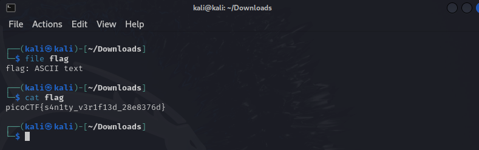

## Table of Contents
- [Challenge Description](#challenge-description)
- [Approach](#approach)
- [Step-by-Step Solution](#step-by-step-solution)

---

## Challenge Description
This file has a flag in plain sight (aka "in-the-clear"). [Download flag](https://mercury.picoctf.net/static/fb851c1858cc762bd4eed569013d7f00/flag).

## Approach
For this section, in-depth explanations aren't necessary as these challenges are only to test the functionality of picoCTF.

## Step-by-Step Solution
1. I'm doing the challenge in Kali Linux as I believe that to be most beneficial. Once the file has been downloaded, here's what I did next:

